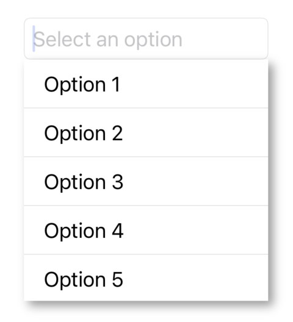
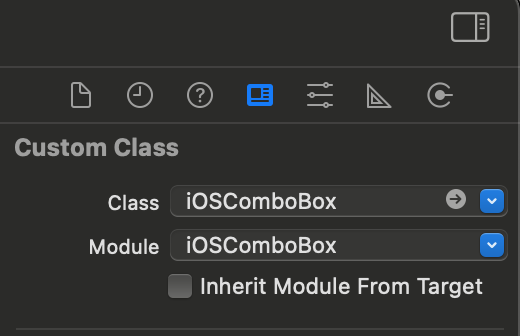

# iOSComboBox 

**iOSComboBox** is a customizable combo box (drop-down) view for iOS, designed to provide a simple way to integrate a selection interface into your apps.

## Features

- Customizable appearance
- Smooth animations for the dropdown
- Easy integration with both Storyboard and programmatically
- Swift and Objective-C compatibility

## Requirements

- iOS 12.0+
- Swift 5.0+
- Xcode 15.0+

## Installation

### Swift Package Manager

iOSComboBox supports installation via [Swift Package Manager](https://github.com/swiftlang/swift-package-manager), which is built into Xcode.

1. In Xcode, select File > **Add Packages...**
2. Paste the repository URL into the search field:
```
https://github.com/rojarand/iOSComboBox.git
```
3. Select the version or branch you want to use.
4. Click Add Package to add it to your project.

### CocoaPods

To integrate iOSComboBox using CocoaPods, follow these steps:

1. Add iOSComboBox to your `Podfile`:
```yaml
pod 'iOSComboBox', '~> 0.0.4'
```
2. Install the pod by running the following command in your terminal:
```terminal
[bundle exec] pod install
```
3. Open your project via the generated `.xcworkspace` file.

## Usage

### Programmatic Usage

Here's an example of how to use iOSComboBox programmatically in Swift:
```swift
import iOSComboBox

class ViewController: UIViewController {
    override func viewDidLoad() {
        let comboBox = iOSComboBox(frame: CGRect(x: 20, y: 100, width: 200, height: 40))
        self.view.addSubview(comboBox)
        comboBox.comboBoxDataSource = self
        comboBox.comboBoxDelegate = self
        comboBox.placeholder = "Select an option"
    }
}

extension ViewController: iOSComboBoxDataSource {
    func numberOfItems(in comboBox: iOSComboBox) -> Int {
        5
    }
    func comboBox(_ comboBox: iOSComboBox, objectValueForItemAt index: Int) -> Any? {
        "Option \(index+1)"
    }
}
```

Result:




### Storyboard Usage
1. Drag a UIView onto your storyboard.
2. Set its class to iOSComboBox in the Identity Inspector.



3. Configure the control's properties in the Attributes Inspector or programmatically.

#### Connecting to Your Code (Objective-C)
```objc
@property (weak, nonatomic) IBOutlet iOSComboBox *comboBox;

- (void)viewDidLoad {
    ...
    //Assuming that the view controller implements iOSComboBoxDataSource and iOSComboBoxDelegate protocols
    _comboBox.comboBoxDataSource = self;
    _comboBox.comboBoxDelegate = self;
}
```

## Customization

**iOSComboBox** allows you to customize various aspects of the control:

**iOSComboBoxDataSource**: Provides various optional methods for interacting with the iOSComboBox, allowing developers to provide the necessary data and behavior for the combo box. The `iOSComboBoxDataSource` is similar to the well known `UITableViewDataSource` interface.

**iOSComboBoxDelegate**: Is designed to handle events and interactions with an iOSComboBox. The delegate provides methods that allow you to respond to user actions or system events, such as selection changes, and other UI-related behaviors. The `iOSComboBoxDelegate` is similar to the well known `UITableViewDelegate` interface.

**Dropdown Appearance**: Customize the dropdown's height, font, and colors.

## Example
To explore a full example, check out the iOSComboBoxApp folder in this repository, which demonstrates how to integrate and use iOSComboBox in various scenarios.


## License
iOSComboBox is released under the MIT license. See [LICENSE](https://en.wikipedia.org/wiki/MIT_License) for details.

